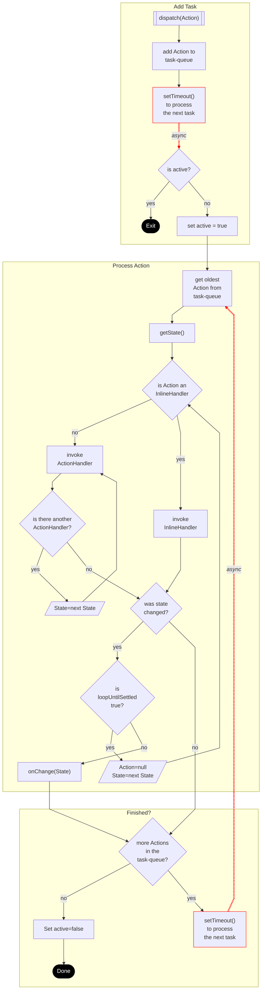

# reshape-state

A small [state management library](libs/reshape-state/README.md). Use a reshaper to manage acquiring data for a state object from multiple asynchronous sources.

## Use and Documentation

The [README](libs/reshape-state/README.md) will get you started using reshape-state.

## Example

This repo. includes code of an [example React application](apps/example-app/src/main.tsx). Live examples can be found on [codesandbox](https://codesandbox.io/s/reshape-state-0617h).

## Publish

Execute the following steps starting in the workspace root directory (same as this file).

- Bump the package.json version field.
- Delete the `dist` directory.
- Build the library: `yarn build`
- Delete the comments that are added by Microsoft from the js files in `dist`.
- `cd` into the "dist/libs/reshape-state" directory.
- `npm publish` using the same version as in the package.json file.

## Technical Details

### Action Processing

Documents the logic implemented to process the Actions in the task-queue.

